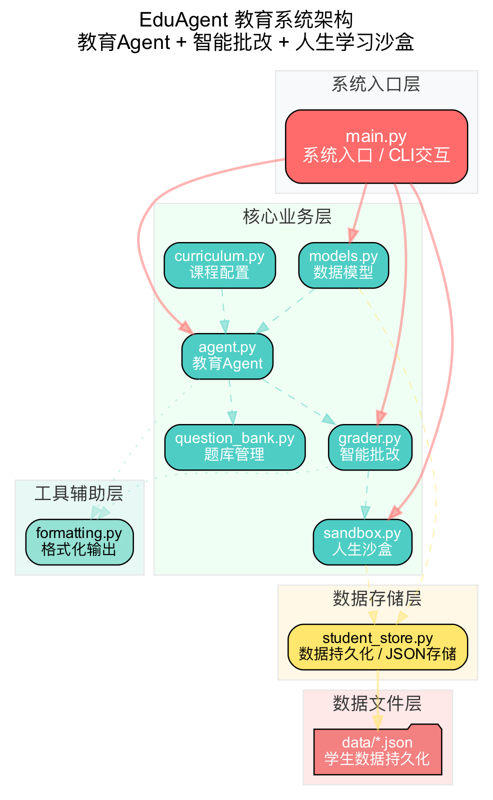
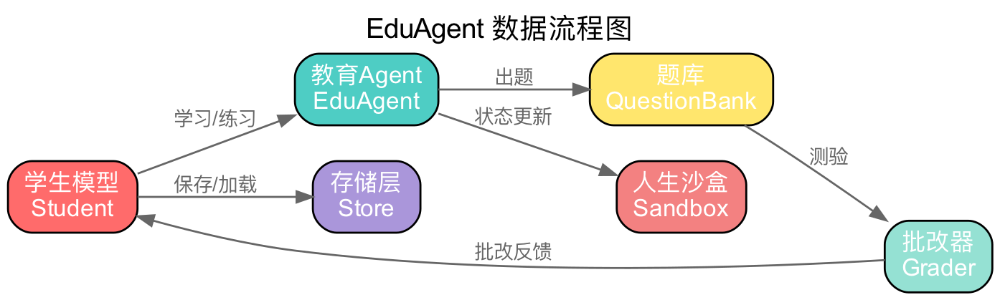
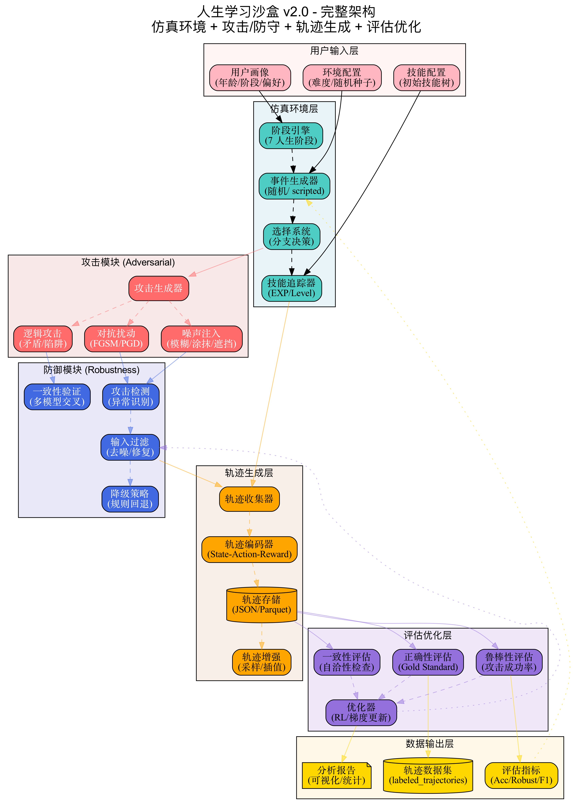
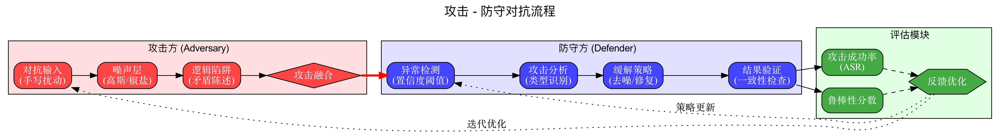
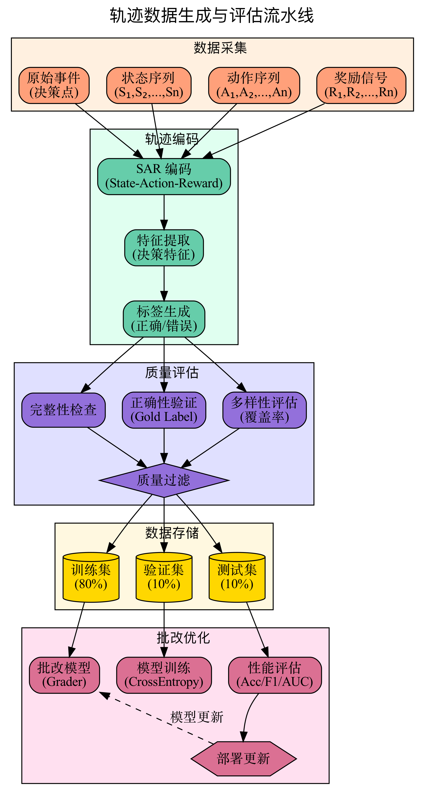
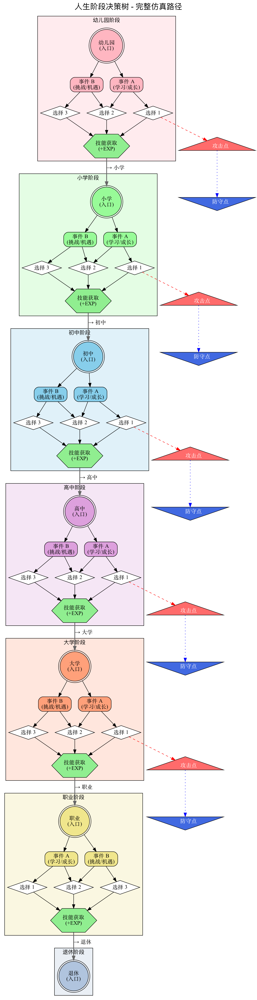

# 🎓 EduAgent v2.0 (Multimodal)

> 教育 Agent + 智能批改 + 人生学习沙盒 + 多模态手写识别

一个完整的 AI 教育平台，支持文本和图像双模输入，包含知识点讲解、智能测验批改、多维度作文评分、人生阶段模拟、手写 OCR 识别、视觉推理等功能。

[](https://www.python.org/downloads/)
[](LICENSE)
[]()
[]()

---

## 📸 系统架构

### 核心架构图



### 数据流



---

## 🎮 人生沙盒架构

**事件驱动 × 选择分支 × 技能成长 × 攻守对抗** —— 模拟人做决策的一生

- **5 层结构**：人生阶段 → 事件系统 → 选择分支 → 技能成长 → 攻守对抗
- **事件类型**：学习事件、挑战事件、机遇事件、随机事件
- **决策分支**：保守路线、冒险路线、平衡路线
- **技能系统**：EXP 获取 → 技能树 → 等级提升 → 成就解锁
- **攻守对抗**：攻击方 (噪声/逻辑) ↔ 防守方 (检测/缓解)

### 完整架构图



**7 层架构**：用户输入 → 仿真环境 → 攻击模块 → 防御模块 → 轨迹生成 → 评估优化 → 数据输出

### 攻守对抗流程



攻击方 (噪声注入/对抗扰动/逻辑攻击) → 防守方 (检测/过滤/验证/降级) → 评估反馈迭代

### 轨迹数据流水线



数据采集 → 轨迹编码 (SAR) → 质量评估 → 数据存储 (训练/验证/测试) → 批改优化

### 人生决策树



7 个人生阶段完整决策路径，含攻击点 ⚠️ 与防守点 🛡️ 标记

---

## ✨ 核心特性

### 📚 教育 Agent
- **分阶段教学**：幼儿园→职业→退休，7 个阶段自动适配课程
- **知识点讲解**：根据学生阶段动态调整难度和教学话术
- **学习计划**：自动分析薄弱知识点，生成个性化学习方案
- **状态跟踪**：实时追踪学习动力、自信度等心理指标

### 📝 智能批改
- **测验批改**：自动评分、逐题反馈、正确率统计
- **作文批改**：多维度评分（结构/内容/语言/逻辑/创意）
- **批量统计**：平均分、最高分、最低分、等级分布
- **动态反馈**：根据成绩调整学生学习动力和自信度

### 🎮 人生学习沙盒
- **阶段演进**：幼儿园→小学→初中→高中→大学→职业→退休
- **事件系统**：每个阶段有独特事件（竞赛、社团、高考、实习等）
- **技能成长**：选择影响技能树，经验值升级系统
- **模拟推演**：按年模拟，随机事件 + 知识点自然掌握

### 🔍 多模态批改 (v2.0 新增)
- **手写 OCR 识别**：支持学生手写答案识别
- **视觉推理**：Think-with-Image 范式，理解图像中的逻辑
- **对抗攻击检测**：检测模糊/噪声/对抗样本，提高系统可靠性
- **图像批改**：直接批改手写试卷图像

---

## 🏗️ 项目结构

```
edu_agent/
├── main.py                   # 系统入口 (演示模式 + 交互模式)
├── core/
│   ├── models.py             # 数据模型 (Student, KnowledgePoint, Skill...)
│   ├── agent.py              # 教育 Agent (教学讲解，学习计划)
│   ├── grader.py             # 智能批改 (测验批改，作文批改，统计)
│   ├── sandbox.py            # 人生沙盒 (阶段推进，事件选择，模拟)
│   ├── question_bank.py      # 题库管理 (按学科/难度查询，随机出题)
│   ├── curriculum.py         # 课程配置 (课程表，教学话术，阶段年龄)
│   └── multimodal.py         # 多模态处理 (OCR, 视觉推理，攻击检测) [新增]
├── storage/
│   └── student_store.py      # JSON 数据持久化
├── utils/
│   └── formatting.py         # 输出格式化 (分隔线，进度条)
└── data/
    └── *.json                # 学生数据文件
```

---

## 🚀 快速开始

### 安装依赖

```bash
# 基础依赖
pip3 install graphviz  # 画图用

# 多模态扩展 (可选，接入真实模型)
pip3 install openai dashscope  # GPT-4V / Qwen-VL
pip3 install paddlepaddle paddleocr  # 本地 OCR
```

### 演示模式

```bash
python3 edu_agent/main.py
```

自动运行所有功能演示：知识点讲解→测验批改→作文批改→人生沙盒→多模态→数据持久化。

### 交互模式

```bash
python3 edu_agent/main.py --interactive
```

进入 CLI 交互界面，支持以下指令：

| 指令 | 说明 | 示例 |
|------|------|------|
| `teach <学科> <知识点>` | 讲解知识点 | `teach 数学 勾股定理` |
| `quiz <学科> <数量>` | 生成测验 | `quiz 物理 5` |
| `grade <答案>` | 批改测验 | `grade 6N,½mv²,v=λf` |
| `essay <标题>` | 批改作文 | `essay 我的梦想` |
| `plan` | 学习计划 | `plan` |
| `status` | 学生状态 | `status` |
| `event <序号> <选项>` | 沙盒事件选择 | `event 1 0` |
| `stage <阶段>` | 推进人生阶段 | `stage 初中` |
| `simulate <年数>` | 模拟生活 | `simulate 3` |
| `save` | 保存数据 | `save` |
| `load <名字>` | 加载数据 | `load 小明` |
| `mm-ocr <图片>` | OCR 识别手写 | `mm-ocr answer.jpg` |
| `mm-grade <图片> <答案>` | 图像批改 | `mm-grade answer.jpg 42` |
| `mm-check <图片>` | 攻击检测 | `mm-check answer.jpg` |
| `quit` | 退出 | `quit` |

---

## 🔌 多模态集成

### 当前状态

`core/multimodal.py` 已预留接口，支持以下能力：

| 功能 | 状态 | 说明 |
|------|------|------|
| OCR 识别 | ⚪ 模拟 | 需接入 PaddleOCR/EasyOCR/云 API |
| 视觉推理 | ⚪ 模拟 | 需接入 GPT-4V/Gemini/Qwen-VL |
| 攻击检测 | ⚪ 框架 | 需接入模糊/噪声/对抗检测模型 |
| 图像批改 | ⚪ 框架 | 综合以上三个能力 |

### 接入 GPT-4V

```python
from openai import OpenAI
from core.multimodal import MultimodalProcessor, ImageInput, VisualReasoningResult

class GPT4VProcessor(MultimodalProcessor):
    def __init__(self, api_key: str):
        self.client = OpenAI(api_key=api_key)

    def visual_reasoning(self, image: ImageInput, question: str = "") -> VisualReasoningResult:
        import base64
        img_data = image.load()
        base64_img = base64.b64encode(img_data).decode()

        response = self.client.chat.completions.create(
            model="gpt-4o",
            messages=[{
                "role": "user",
                "content": [
                    {"type": "text", "text": question or "分析这张图"},
                    {"type": "image_url", "image_url": {"url": f"data:image/png;base64,{base64_img}"}}
                ]
            }]
        )

        return VisualReasoningResult(
            description=response.choices[0].message.content,
            entities=[],
            relationships=[],
            reasoning_chain=[response.choices[0].message.content],
            confidence=0.9,
        )
```

### 接入 Qwen-VL（阿里云）

```python
from dashscope import MultiModalConversation
from core.multimodal import MultimodalProcessor, ImageInput, VisualReasoningResult

class QwenVLProcessor(MultimodalProcessor):
    def __init__(self, api_key: str):
        self.api_key = api_key

    def visual_reasoning(self, image: ImageInput, question: str = "") -> VisualReasoningResult:
        response = MultiModalConversation.call(
            model='qwen-vl-max',
            messages=[{
                "role": "user",
                "content": [
                    {"image": image.path or image.url},
                    {"text": question or "分析这张图"}
                ]
            }]
        )
        return VisualReasoningResult(
            description=response.output.choices[0].message.content[0]["text"],
            entities=[],
            relationships=[],
            reasoning_chain=[response.output.choices[0].message.content[0]["text"]],
            confidence=0.85,
        )
```

### 接入 PaddleOCR（本地）

```python
from paddleocr import PaddleOCR
from core.multimodal import MultimodalProcessor, ImageInput, OCRResult

class PaddleOCRProcessor(MultimodalProcessor):
    def __init__(self):
        self.ocr = PaddleOCR(use_angle_cls=True, lang='ch')

    def ocr(self, image: ImageInput) -> OCRResult:
        img_path = image.path
        result = self.ocr.ocr(img_path, cls=True)

        blocks = []
        texts = []
        for line in result[0]:
            bbox, (text, conf) = line
            blocks.append({"text": text, "bbox": bbox, "confidence": conf})
            texts.append(text)

        return OCRResult(
            text="\n".join(texts),
            confidence=sum(b["confidence"] for b in blocks) / len(blocks),
            blocks=blocks,
            is_handwritten=True,
            quality_score=0.9,
        )
```

---

## 📊 学科与题库

| 学科 | 难度覆盖 | 题目数量 |
|------|----------|----------|
| 数学 | 简单/中等/困难 | 15+ |
| 物理 | 简单/中等/困难 | 9+ |
| 计算机科学 | 中等/困难 | 6+ |
| 语文/英语 | 话术模板 | 可扩 |

---

## 🔧 扩展指南

### 添加新学科题目

编辑 `core/question_bank.py`，在 `_QUESTION_BANK` 字典中添加：

```python
Subject.CHEMISTRY: {
    Difficulty.EASY: [
        {"question": "水的化学式是？", "options": ["H₂O", "CO₂", "NaCl", "O₂"], "answer": "H₂O"},
    ],
}
```

### 添加新阶段事件

编辑 `core/sandbox.py`，在 `_STAGE_EVENTS` 字典中添加：

```python
LifeStage.UNIVERSITY: [
    LifeEvent("实习机会", "一家知名公司有实习机会，要申请吗？",
              ["申请", "继续学习"], {"实践经验": 20, "职场技能": 15}),
]
```

### 自定义教学话术

编辑 `core/curriculum.py`，在 `EXPLANATIONS` 字典中添加：

```python
Subject.CHEMISTRY: [
    "化学是研究物质变化的科学。让我们从实验现象出发...",
]
```

---

## 📐 架构图生成

```bash
cd edu_agent
python3 generate_sandbox_diagrams.py
```

生成的架构图保存在 `docs/` 目录下：
- `sandbox_architecture.png` - 沙盒完整架构图 (7 层)
- `sandbox_flow.png` - 人生沙盒核心流程图
- `attack_defense_flow.png` - 攻守对抗流程
- `trajectory_pipeline.png` - 轨迹数据流水线
- `life_decision_tree.png` - 人生决策树

---

## 📝 示例输出

### 测验批改

```
📝 数学测验 (5 题):

  1. sin(90°) = ?
     ['0', '1', '-1', '0.5']
  2. x² - 4 = 0, x = ?
     ['±2', '±4', '2', '4']
  ...

📊 批改结果：80.0 分 (B (良好)) | 正确：4/5
  ✅ 第 1 题：1 → 1
  ❌ 第 2 题：4 → ±2
  ...
```

### 多模态批改

```
> mm-ocr answer.jpg
OCR Result:
解：设 x = 5
则 y = x + 3 = 8
答：y = 8

   Confidence: 94.5%
   Handwritten: Yes
   Quality: 0.92
```

### 人生沙盒报告

```
╔════════════════════════════════════════╗
║        📜 人生学习沙盒报告                ║
╠════════════════════════════════════════╣
║  姓名：小明                    ║
║  年龄：21 岁                                ║
║  阶段：高中                ║
║  学习时长：1601.5 小时                     ║
║  知识点：3 个                          ║
║  掌握率：0.0%                          ║
╠════════════════════════════════════════╣
║  技能树：                                  ║
║      • 逻辑思维：Lv.1 (EXP: 30)          ║
║      • 阅读能力：Lv.1 (EXP: 15)          ║
║      ...
╚════════════════════════════════════════╝
```

---

## 🔮 后续方向

根据业务需求，可扩展以下能力：

1. **手写公式识别** - 集成 LaTeX OCR
2. **几何题理解** - 图形 + 文字联合推理
3. **化学方程式识别** - 特殊符号处理
4. **解题步骤批改** - 过程而不只是答案
5. **多模态对抗检测** - 手写 adversarial 检测

---

## 📜 License

MIT
